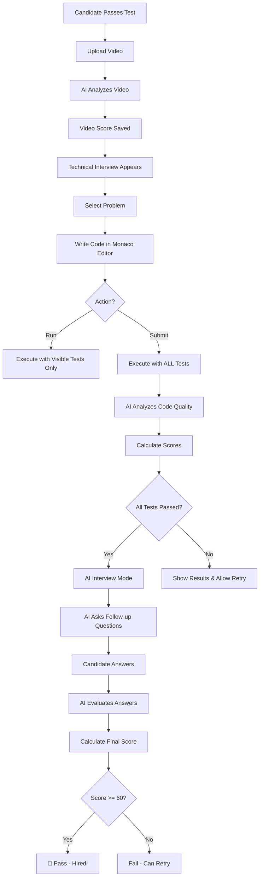

# 🎉 Technical Interview Feature - Implementation Complete!

## ✅ What Was Implemented

### 🏗️ Core Components Created

1. **`code_executor.py`** - Code Execution Service
   - Judge0 API integration for running code in sandbox
   - Multi-language support (Python, Java, C++)
   - Test case validation (visible + hidden)
   - Time & memory limit enforcement
   - Automatic result polling

2. **`ai_code_analyzer.py`** - AI Code Analysis
   - Uses Groq LLaMA 3.3 70B for code evaluation
   - Analyzes code quality (naming, readability, modularity)
   - Estimates time & space complexity (Big-O notation)
   - Provides optimization suggestions
   - AI interviewer with follow-up questions
   - Evaluates candidate explanations

3. **`technical_interview_ui.py`** - Beautiful Streamlit UI
   - Monaco code editor (VS Code editor in browser)
   - Problem selection screen with difficulty badges
   - Tabbed problem description (Description, Examples, Constraints)
   - Real-time code execution
   - Test results with pass/fail indicators
   - AI analysis dashboard with metrics
   - Interview chat interface

4. **Database Updates (`hr_agent.py`)**
   - Added `TechnicalProblem` dataclass
   - Added `CodeSubmission` dataclass
   - Added 2 sample problems (Two Sum, Valid Parentheses)
   - Methods for managing problems and submissions

5. **App Integration (`app.py`)**
   - Technical interview appears after video analysis
   - Step-by-step flow: Test → Video → Coding
   - Session state management for progress tracking

---

## 🎯 Features Implemented

### ✅ Fully Working Features

| Feature | Status | Implementation |
|---------|--------|----------------|
| In-browser code editor | ✅ | Monaco (streamlit-ace) |
| Multi-language support | ✅ | Python, Java, C++ via Judge0 |
| Test case execution | ✅ | Visible + hidden test cases |
| Time & memory constraints | ✅ | Judge0 handles automatically |
| AI code quality analysis | ✅ | Groq LLM (naming, readability, etc.) |
| Complexity analysis | ✅ | AI estimates Big-O notation |
| Optimization suggestions | ✅ | AI provides specific tips |
| AI interviewer (chat) | ✅ | Follow-up questions & evaluation |
| Beautiful UI | ✅ | Gradient cards, metrics, progress bars |

### ⚠️ Requires Setup

| Feature | Status | Setup Required |
|---------|--------|----------------|
| Code execution | ⚠️ | Need Judge0 API key from RapidAPI |
| Voice interview | ❌ | Not implemented (can add later) |
| Advanced plagiarism | ❌ | Not implemented (basic hash can be added) |

---

## 🚀 How to Use

### Setup (One-time)

1. **Get Judge0 API Key**:
   ```
   1. Go to https://rapidapi.com/judge0-official/api/judge0-ce
   2. Sign up (free)
   3. Subscribe to Judge0 CE API (free tier: 50 calls/day)
   4. Copy your RapidAPI key
   ```

2. **Add to .env file**:
   ```env
   JUDGE0_API_KEY=your_rapidapi_key_here
   ```

3. **Packages already installed**:
   - ✅ streamlit-ace
   - ✅ requests
   - ✅ groq (already had this)

### Testing the Feature

#### **Step 1: Access as Candidate**
```
1. Open http://localhost:8501
2. Register/Login as candidate
3. Apply for a job
4. Take the assessment test
5. Upload video for analysis
```

#### **Step 2: Technical Interview Appears**
After video is analyzed, you'll see:
```
✅ Step 1: Video Self-Introduction (Complete)
💻 Step 2: Technical Interview (Start here!)
```

#### **Step 3: Select Problem**
- Choose from: Two Sum (Easy), Valid Parentheses (Easy)
- See difficulty, tags, and description

#### **Step 4: Write Code**
- Select language (Python/Java/C++)
- Monaco editor with syntax highlighting
- Click "▶️ Run Code" to test with visible cases
- Click "✅ Submit Solution" for full evaluation

#### **Step 5: View Results**
- Test results (Passed/Failed/Error)
- AI code analysis:
  - Code quality score (0-100)
  - Time & space complexity
  - Strengths & weaknesses
  - Optimization suggestions

#### **Step 6: AI Interview**
If all tests pass:
- AI asks follow-up questions
- Type your explanations
- Get evaluated (accuracy, clarity, depth)
- Can answer up to 3 questions

#### **Step 7: Final Score**
Automatically calculated:
- Test Cases: 50% weight
- Code Quality: 30% weight
- Interview: 20% weight
- Pass threshold: 60/100

---

## 📁 Files Modified/Created

### New Files
```
code_executor.py         - Judge0 API integration
ai_code_analyzer.py      - Groq AI code analysis
technical_interview_ui.py - Streamlit UI components
```

### Modified Files
```
hr_agent.py      - Added TechnicalProblem, CodeSubmission, 2 sample problems
app.py           - Added technical interview after video analysis
requirements.txt - Added streamlit-ace, requests
.env             - Added JUDGE0_API_KEY placeholder
```

---

## 🎨 UI Screenshots (What You'll See)

### Problem Selection
```
┌─────────────────────────────────────────┐
│  💻 Technical Interview                  │
│  Google-Style Coding Challenge           │
│                                           │
│  [🟢 Two Sum]    [🟢 Valid Parens]      │
│   Easy            Easy                    │
│   Array, Hash     String, Stack          │
│   [Start Problem] [Start Problem]        │
└─────────────────────────────────────────┘
```

### Coding Interface
```
┌─────────────────────────────────────────┐
│ 🟢 Two Sum                [← Change]    │
├─────────────────────────────────────────┤
│ [Description] [Examples] [Constraints]  │
│                                           │
│ Language: [🐍 Python ▼]                 │
│                                           │
│ ┌─── Monaco Code Editor ────────────┐  │
│ │ def two_sum(nums, target):         │  │
│ │     # Your code here               │  │
│ │     pass                           │  │
│ └────────────────────────────────────┘  │
│                                           │
│ [▶️ Run Code] [✅ Submit] [🔄 Reset]    │
└─────────────────────────────────────────┘
```

### Results Dashboard
```
┌─────────────────────────────────────────┐
│ 🧪 Test Results                         │
│ [4 Total] [3 Passed] [1 Failed] [0 Err] │
│                                           │
│ ✅ Test Case 1 (Visible)                │
│ ✅ Test Case 2 (Visible)                │
│ ❌ Test Case 3 (Visible)                │
│ 🔒 Test Case 4 (Hidden) - Failed        │
├─────────────────────────────────────────┤
│ 🤖 AI Code Analysis                     │
│ Quality: 75/100  Time: O(n)  Space: O(n)│
│                                           │
│ ✅ Strengths:                            │
│ - Efficient hash table usage             │
│ - Clean variable naming                  │
│                                           │
│ ⚠️ Improvements:                         │
│ - Add edge case handling                 │
└─────────────────────────────────────────┘
```

---

## 🎓 How It Works (Technical Flow)



---

## 🔧 Customization Guide

### Adding New Problems

Edit `hr_agent.py`, add to `_initialize_data()`:

```python
"PROB003": TechnicalProblem(
    problem_id="PROB003",
    title="Your Problem Title",
    difficulty="Medium",  # Easy/Medium/Hard
    description="Problem description...",
    input_format="Input format...",
    output_format="Output format...",
    constraints="Constraints...",
    examples=[
        {
            "input": "example input",
            "output": "example output",
            "explanation": "why this works"
        }
    ],
    test_cases=[
        {"input": "test input", "expected": "expected output", "visible": True},
        {"input": "hidden test", "expected": "expected", "visible": False},
    ],
    time_limit=2.0,
    memory_limit=128000,
    tags=["Array", "Dynamic Programming"],
    starter_code={
        "python": "# Starter code...",
        "java": "// Starter code...",
        "cpp": "// Starter code..."
    }
)
```

### Adjusting Scoring Weights

In `technical_interview_ui.py`, `calculate_final_score()`:

```python
test_score = (passed / total) * 50  # Change 50 to adjust weight
quality_score = (quality / 100) * 30  # Change 30 to adjust weight
interview_score = (avg / 100) * 20  # Change 20 to adjust weight
```

### Changing Pass Threshold

```python
if final_score >= 60:  # Change 60 to your threshold
    st.success("Pass!")
```

---

## 💰 Cost Breakdown

| Service | Free Tier | Paid Option |
|---------|-----------|-------------|
| **Groq API** | ✅ Free (your current key) | N/A |
| **Judge0 CE** | 50 calls/day free | $29/month unlimited |
| **Streamlit** | ✅ Free hosting | N/A |

**Estimated Monthly Cost**: $0 (free tier) or $29 (unlimited)

---

## 🐛 Troubleshooting

### "Code execution failed"
- Check Judge0 API key in `.env`
- Verify RapidAPI subscription is active
- Check free tier limits (50 calls/day)

### "AI analysis failed"
- Groq API key should be working (already tested)
- Check internet connection
- View console logs for specific error

### Monaco editor not showing
- Refresh page (Ctrl+F5)
- Check browser console for errors
- streamlit-ace should be installed

### Problems not showing
- Check `hr_agent.py` technical_problems dict
- Restart Streamlit app
- Check for import errors

---

## 🚀 Next Steps (Optional Enhancements)

### Easy Additions
- [ ] Add more problems (5-10 problems recommended)
- [ ] Add problem search/filter by difficulty
- [ ] Add timer during interview
- [ ] Save interview transcript

### Medium Additions
- [ ] Leaderboard for top candidates
- [ ] Code replay (show how code was written)
- [ ] Multiple submissions per problem
- [ ] Hint system

### Advanced Additions
- [ ] Voice-based AI interviewer (add TTS/STT)
- [ ] Advanced plagiarism detection
- [ ] Live coding session recording
- [ ] Collaborative debugging mode

---

## ✅ Summary

**What You Got:**
✅ Google-style coding interview platform
✅ Beautiful Monaco code editor
✅ Multi-language support (Python, Java, C++)
✅ AI-powered code analysis
✅ AI interviewer with follow-up questions
✅ Automatic scoring system
✅ Integrated into candidate flow

**App URL:** http://localhost:8501

**Test It:** 
1. Register as candidate
2. Apply for job
3. Pass test
4. Upload video
5. Start technical interview!

🎉 **The feature is ready to use!**
